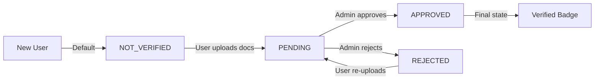

# Admin Verification Management - Frontend Implementation Guide

Complete guide for implementing admin verification management in your frontend application.

---

## Table of Contents
1. [Overview](#overview)
2. [Status Flow](#status-flow)
3. [API Endpoints](#api-endpoints)
4. [Frontend Implementation](#frontend-implementation)
5. [Error Handling](#error-handling)
6. [UI/UX Recommendations](#uiux-recommendations)
7. [Complete Examples](#complete-examples)

---

## Overview

The admin verification system allows administrators to review, approve, or reject user-submitted verification documents. This guide provides everything you need to implement this in your frontend.

### Verification Status States

```typescript
type VerificationStatus = 'NOT_VERIFIED' | 'PENDING' | 'APPROVED' | 'REJECTED';

// Status descriptions:
// NOT_VERIFIED - User hasn't uploaded any documents (new users)
// PENDING - Documents uploaded, awaiting admin review
// APPROVED - Admin approved, user is now verified
// REJECTED - Admin rejected, user can retry
```

### Key Features
- ✅ List all pending verifications
- ✅ Filter by status, user, pagination
- ✅ Approve verifications (updates user status atomically)
- ✅ Reject with reason (minimum 10 characters)
- ✅ Real-time updates via transaction safety

---

## Status Flow



### State Transitions

| From | Action | To | Side Effects |
|------|--------|-----|--------------|
| NOT_VERIFIED | User uploads ID | PENDING | Creates Verification record |
| PENDING | Admin approves | APPROVED | Sets isVerified=true, verificationLevel=VERIFIED |
| PENDING | Admin rejects | REJECTED | Stores rejection reason in adminNotes |
| REJECTED | User re-uploads | PENDING | Creates new Verification record |

---

## API Endpoints

### 1. Get Pending Verifications

**Endpoint:** `GET /api/admin/verifications/pending`

**Headers:**
```typescript
{
  'Authorization': 'Bearer <ADMIN_TOKEN>',
  'Content-Type': 'application/json',
  'ngrok-skip-browser-warning': 'true'
}
```

**Response (200):**
```json
{
  "verifications": [
    {
      "id": "e7f19dce-5c95-4233-88c9-5457cee8fb51",
      "userId": "0420a5b0-ad2e-4ada-9dfa-b5aa064719db",
      "documentType": "STUDENT_ID",
      "documentFrontUrl": "/uploads/verifications/front-1234.jpg",
      "documentBackUrl": "/uploads/verifications/back-1234.jpg",
      "status": "PENDING",
      "adminNotes": null,
      "createdAt": "2026-01-04T10:30:00.000Z",
      "updatedAt": "2026-01-04T10:30:00.000Z",
      "user": {
        "id": "0420a5b0-ad2e-4ada-9dfa-b5aa064719db",
        "email": "student@unn.edu.ng",
        "fullName": "John Doe",
        "faculty": "Engineering",
        "department": "Computer Science",
        "isVerified": false,
        "verificationLevel": "BASIC"
      }
    }
  ],
  "total": 12
}
```

**Frontend Code:**
```typescript
import api from '../lib/api';

interface PendingVerificationsResponse {
  verifications: Verification[];
  total: number;
}

const fetchPendingVerifications = async (): Promise<PendingVerificationsResponse> => {
  const { data } = await api.get<PendingVerificationsResponse>(
    '/admin/verifications/pending'
  );
  return data;
};

// Using React Query
import { useQuery } from '@tanstack/react-query';

function PendingVerificationsPage() {
  const { data, isLoading, error } = useQuery({
    queryKey: ['admin', 'verifications', 'pending'],
    queryFn: fetchPendingVerifications,
    refetchInterval: 30000, // Auto-refresh every 30 seconds
  });

  if (isLoading) return <LoadingSpinner />;
  if (error) return <ErrorMessage error={error} />;

  return (
    <div>
      <h1>Pending Verifications ({data.total})</h1>
      {data.verifications.map(verification => (
        <VerificationCard key={verification.id} verification={verification} />
      ))}
    </div>
  );
}
```

---

### 2. Get All Verifications (Filtered & Paginated)

**Endpoint:** `GET /api/admin/verifications`

**Query Parameters:**
```typescript
interface VerificationFilters {
  status?: 'NOT_VERIFIED' | 'PENDING' | 'APPROVED' | 'REJECTED';
  userId?: string;
  page?: number;  // Default: 1
  limit?: number; // Default: 20
}
```

**Example Request:**
```bash
GET /api/admin/verifications?status=PENDING&page=1&limit=10
```

**Response (200):**
```json
{
  "verifications": [...],
  "pagination": {
    "total": 50,
    "page": 1,
    "limit": 10,
    "totalPages": 5
  }
}
```

**Frontend Code:**
```typescript
const fetchVerifications = async (filters: VerificationFilters) => {
  const params = new URLSearchParams();
  if (filters.status) params.append('status', filters.status);
  if (filters.userId) params.append('userId', filters.userId);
  if (filters.page) params.append('page', filters.page.toString());
  if (filters.limit) params.append('limit', filters.limit.toString());

  const { data } = await api.get(`/admin/verifications?${params.toString()}`);
  return data;
};

// Component with filters
function VerificationsTable() {
  const [filters, setFilters] = useState<VerificationFilters>({
    status: undefined,
    page: 1,
    limit: 20,
  });

  const { data } = useQuery({
    queryKey: ['admin', 'verifications', filters],
    queryFn: () => fetchVerifications(filters),
  });

  return (
    <div>
      {/* Status Filter */}
      <select 
        value={filters.status || ''} 
        onChange={(e) => setFilters({ ...filters, status: e.target.value as VerificationStatus })}
      >
        <option value="">All Statuses</option>
        <option value="NOT_VERIFIED">Not Verified</option>
        <option value="PENDING">Pending</option>
        <option value="APPROVED">Approved</option>
        <option value="REJECTED">Rejected</option>
      </select>

      {/* Pagination */}
      <Pagination 
        currentPage={filters.page} 
        totalPages={data?.pagination.totalPages}
        onPageChange={(page) => setFilters({ ...filters, page })}
      />
    </div>
  );
}
```

---

### 3. Approve Verification

**Endpoint:** `POST /api/admin/verifications/:id/approve`

**Request:**
```bash
POST /api/admin/verifications/e7f19dce-5c95-4233-88c9-5457cee8fb51/approve
Authorization: Bearer <ADMIN_TOKEN>
```

**Response (200):**
```json
{
  "message": "Verification approved successfully",
  "verification": {
    "id": "e7f19dce-5c95-4233-88c9-5457cee8fb51",
    "status": "APPROVED",
    "adminNotes": "Approved by admin cabee721-8d72-4751-b33b-448715a9c113 on 2026-01-04T12:00:00.000Z",
    "updatedAt": "2026-01-04T12:00:00.000Z"
  },
  "user": {
    "id": "0420a5b0-ad2e-4ada-9dfa-b5aa064719db",
    "email": "student@unn.edu.ng",
    "isVerified": true,
    "verificationLevel": "VERIFIED"
  }
}
```

**Frontend Code:**
```typescript
import { useMutation, useQueryClient } from '@tanstack/react-query';

const approveVerification = async (verificationId: string) => {
  const { data } = await api.post(
    `/admin/verifications/${verificationId}/approve`
  );
  return data;
};

function ApproveButton({ verificationId }: { verificationId: string }) {
  const queryClient = useQueryClient();
  const { showToast } = useToast();

  const approveMutation = useMutation({
    mutationFn: approveVerification,
    onSuccess: (data) => {
      showToast('success', 'Approved', `${data.user.email} is now verified!`);
      // Invalidate queries to refresh the list
      queryClient.invalidateQueries({ queryKey: ['admin', 'verifications'] });
    },
    onError: (error: any) => {
      showToast('error', 'Approval Failed', error.response?.data?.message || 'An error occurred');
    },
  });

  return (
    <button
      onClick={() => approveMutation.mutate(verificationId)}
      disabled={approveMutation.isPending}
      className="btn-success"
    >
      {approveMutation.isPending ? 'Approving...' : 'Approve'}
    </button>
  );
}
```

---

### 4. Reject Verification

**Endpoint:** `POST /api/admin/verifications/:id/reject`

**Request Body:**
```json
{
  "reason": "Documents are unclear. Please upload higher quality images showing all details clearly."
}
```

**Validation:**
- `reason` is required
- Minimum length: 10 characters
- Recommended: Be specific and constructive

**Response (200):**
```json
{
  "message": "Verification rejected",
  "verification": {
    "id": "e7f19dce-5c95-4233-88c9-5457cee8fb51",
    "status": "REJECTED",
    "adminNotes": "Rejected by admin cabee721... on 2026-01-04T12:00:00.000Z. Reason: Documents are unclear...",
    "updatedAt": "2026-01-04T12:00:00.000Z"
  },
  "rejectionReason": "Documents are unclear. Please upload higher quality images showing all details clearly."
}
```

**Frontend Code:**
```typescript
interface RejectVerificationRequest {
  verificationId: string;
  reason: string;
}

const rejectVerification = async ({ verificationId, reason }: RejectVerificationRequest) => {
  const { data } = await api.post(
    `/admin/verifications/${verificationId}/reject`,
    { reason }
  );
  return data;
};

function RejectDialog({ verificationId, onClose }: RejectDialogProps) {
  const [reason, setReason] = useState('');
  const queryClient = useQueryClient();
  const { showToast } = useToast();

  const rejectMutation = useMutation({
    mutationFn: rejectVerification,
    onSuccess: (data) => {
      showToast('success', 'Rejected', 'User has been notified');
      queryClient.invalidateQueries({ queryKey: ['admin', 'verifications'] });
      onClose();
    },
    onError: (error: any) => {
      showToast('error', 'Rejection Failed', error.response?.data?.message);
    },
  });

  const handleSubmit = () => {
    if (reason.length < 10) {
      showToast('error', 'Invalid Reason', 'Reason must be at least 10 characters');
      return;
    }
    rejectMutation.mutate({ verificationId, reason });
  };

  return (
    <Dialog open onClose={onClose}>
      <h2>Reject Verification</h2>
      <textarea
        value={reason}
        onChange={(e) => setReason(e.target.value)}
        placeholder="Explain why you're rejecting this verification (min 10 characters)..."
        rows={4}
        className="w-full"
      />
      <div className="text-sm text-slate-500 mt-1">
        {reason.length}/10 characters minimum
      </div>
      <div className="flex gap-3 mt-4">
        <button onClick={onClose} className="btn-outline">Cancel</button>
        <button
          onClick={handleSubmit}
          disabled={reason.length < 10 || rejectMutation.isPending}
          className="btn-danger"
        >
          {rejectMutation.isPending ? 'Rejecting...' : 'Reject'}
        </button>
      </div>
    </Dialog>
  );
}
```

---

## Error Handling

### Common Error Scenarios

```typescript
// Error responses you should handle:

// 401 Unauthorized - Not logged in
{
  "message": "Not authorized"
}

// 403 Forbidden - Not an admin
{
  "message": "Admin access required"
}

// 404 Not Found - Verification doesn't exist
{
  "message": "Verification not found"
}

// 400 Bad Request - Invalid status
{
  "message": "Cannot approve verification with status: APPROVED"
}

// 400 Bad Request - Short rejection reason
{
  "message": "Rejection reason is required (minimum 10 characters)"
}

// 500 Server Error
{
  "message": "Server error",
  "error": "..."
}
```

### Error Handling Pattern

```typescript
// Axios interceptor for global error handling
api.interceptors.response.use(
  (response) => response,
  (error) => {
    if (error.response?.status === 401) {
      // Redirect to login
      window.location.href = '/login';
    } else if (error.response?.status === 403) {
      // Show access denied message
      showToast('error', 'Access Denied', 'You need admin privileges');
    }
    return Promise.reject(error);
  }
);

// Component-level error handling
const { error } = useQuery({
  queryKey: ['verifications'],
  queryFn: fetchVerifications,
  retry: (failureCount, error: any) => {
    // Don't retry on 4xx errors
    if (error.response?.status >= 400 && error.response?.status < 500) {
      return false;
    }
    return failureCount < 3;
  },
});

if (error) {
  return (
    <ErrorState
      title="Failed to load verifications"
      message={error.response?.data?.message || 'Please try again'}
      onRetry={() => queryClient.invalidateQueries()}
    />
  );
}
```

---

## UI/UX Recommendations

### 1. Verification Card Design

```typescript
function VerificationCard({ verification }: { verification: Verification }) {
  const [showImages, setShowImages] = useState(false);

  return (
    <div className="glass-panel p-6">
      {/* User Info */}
      <div className="flex items-center gap-4 mb-4">
        <Avatar user={verification.user} />
        <div>
          <h3 className="font-semibold">{verification.user.fullName}</h3>
          <p className="text-sm text-slate-500">{verification.user.email}</p>
          <p className="text-xs text-slate-400">
            {verification.user.faculty} • {verification.user.department}
          </p>
        </div>
      </div>

      {/* Document Info */}
      <div className="mb-4">
        <span className="text-sm font-medium">Document Type:</span>
        <span className="ml-2 text-sm">{verification.documentType}</span>
      </div>

      {/* Submission Time */}
      <div className="text-xs text-slate-400 mb-4">
        Submitted {formatDistanceToNow(new Date(verification.createdAt))} ago
      </div>

      {/* Document Images */}
      <button
        onClick={() => setShowImages(!showImages)}
        className="text-accent text-sm font-medium mb-2"
      >
        {showImages ? 'Hide' : 'View'} Documents
      </button>

      {showImages && (
        <div className="grid grid-cols-2 gap-4 mb-4">
          
          
        </div>
      )}

      {/* Actions */}
      <div className="flex gap-3">
        <ApproveButton verificationId={verification.id} />
        <RejectButton verificationId={verification.id} />
      </div>
    </div>
  );
}
```

### 2. Status Badge

```typescript
function StatusBadge({ status }: { status: VerificationStatus }) {
  const styles = {
    NOT_VERIFIED: 'bg-slate-100 text-slate-600',
    PENDING: 'bg-yellow-100 text-yellow-700',
    APPROVED: 'bg-green-100 text-green-700',
    REJECTED: 'bg-red-100 text-red-700',
  };

  const icons = {
    NOT_VERIFIED: <AlertCircle className="w-3 h-3" />,
    PENDING: <Clock className="w-3 h-3" />,
    APPROVED: <CheckCircle className="w-3 h-3" />,
    REJECTED: <XCircle className="w-3 h-3" />,
  };

  return (
    <span className={`inline-flex items-center gap-1 px-2 py-1 rounded-full text-xs font-medium ${styles[status]}`}>
      {icons[status]}
      {status.replace('_', ' ')}
    </span>
  );
}
```

### 3. Optimistic Updates

```typescript
const approveMutation = useMutation({
  mutationFn: approveVerification,
  onMutate: async (verificationId) => {
    // Cancel outgoing refetches
    await queryClient.cancelQueries({ queryKey: ['admin', 'verifications'] });

    // Snapshot the previous value
    const previousData = queryClient.getQueryData(['admin', 'verifications']);

    // Optimistically update to the new value
    queryClient.setQueryData(['admin', 'verifications'], (old: any) => ({
      ...old,
      verifications: old.verifications.filter((v: any) => v.id !== verificationId),
      total: old.total - 1,
    }));

    return { previousData };
  },
  onError: (err, variables, context) => {
    // Rollback on error
    if (context?.previousData) {
      queryClient.setQueryData(['admin', 'verifications'], context.previousData);
    }
  },
  onSettled: () => {
    queryClient.invalidateQueries({ queryKey: ['admin', 'verifications'] });
  },
});
```

---

## Complete Examples

### Full Admin Verification Dashboard

```typescript
import { useState } from 'react';
import { useQuery, useMutation, useQueryClient } from '@tanstack/react-query';
import api from '../lib/api';

export function AdminVerificationDashboard() {
  const [activeTab, setActiveTab] = useState<'pending' | 'all'>('pending');
  const [filters, setFilters] = useState({ status: 'PENDING', page: 1, limit: 10 });
  const queryClient = useQueryClient();

  // Fetch data
  const { data, isLoading } = useQuery({
    queryKey: ['admin', 'verifications', activeTab, filters],
    queryFn: () => activeTab === 'pending' 
      ? api.get('/admin/verifications/pending').then(res => res.data)
      : api.get(`/admin/verifications?${new URLSearchParams(filters as any)}`).then(res => res.data),
    refetchInterval: 30000,
  });

  if (isLoading) return <LoadingState />;

  return (
    <div className="max-w-7xl mx-auto p-6">
      <h1 className="text-3xl font-bold mb-8">Verification Management</h1>

      {/* Tabs */}
      <div className="flex gap-4 mb-6">
        <button
          onClick={() => setActiveTab('pending')}
          className={activeTab === 'pending' ? 'tab-active' : 'tab'}
        >
          Pending ({data?.total || 0})
        </button>
        <button
          onClick={() => setActiveTab('all')}
          className={activeTab === 'all' ? 'tab-active' : 'tab'}
        >
          All Verifications
        </button>
      </div>

      {/* Filters (for 'all' tab) */}
      {activeTab === 'all' && (
        <VerificationFilters filters={filters} onChange={setFilters} />
      )}

      {/* Verification List */}
      <div className="grid gap-6">
        {data?.verifications?.map((verification: any) => (
          <VerificationCard key={verification.id} verification={verification} />
        ))}
      </div>

      {/* Pagination */}
      {data?.pagination && (
        <Pagination pagination={data.pagination} onPageChange={(page) => setFilters({ ...filters, page })} />
      )}
    </div>
  );
}
```

---

## Testing Checklist

- [ ] Can list pending verifications
- [ ] Can filter by status (NOT_VERIFIED, PENDING, APPROVED, REJECTED)
- [ ] Can filter by user ID
- [ ] Pagination works correctly
- [ ] Can approve a pending verification
- [ ] User status updates after approval (isVerified: true, verificationLevel: VERIFIED)
- [ ] Can reject with valid reason (≥10 chars)
- [ ] Cannot reject with short reason (<10 chars)
- [ ] Cannot approve already approved verification
- [ ] Cannot approve rejected verification without re-upload
- [ ] Error handling for 401/403/404/500 errors
- [ ] Loading states show during API calls
- [ ] Optimistic updates work correctly
- [ ] Auto-refresh works for pending list
- [ ] Non-admin users cannot access endpoints

---

## Best Practices

1. **Always invalidate queries** after mutations to keep data fresh
2. **Use optimistic updates** for better UX
3. **Show clear error messages** to help admins understand issues
4. **Auto-refresh pending list** every 30-60 seconds
5. **Require confirmation** before rejecting (destructive action)
6. **Show document preview** before making decision
7. **Log all admin actions** for audit trail
8. **Rate limit** approval/rejection actions to prevent mistakes
9. **Use TypeScript** for type safety
10. **Test with real images** to ensure UI handles different sizes/formats

---

**Pro Tip:** Implement keyboard shortcuts for power users:
- `A` = Approve
- `R` = Reject
- `→` = Next verification
- `←` = Previous verification
